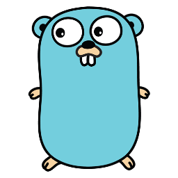

# CURSO DE GOLANG
👨‍⚖️GO É UMA LINGUAGEM DE PROGRAMAÇÃO.

  

## VISÃO PANORÂMICA:
| PERGUNTA | RESPOSTA |
| :---: | :---: |
| DATA DE CRIAÇÃO | 2007 |
| NOME DO CRIADOR | Robert Griesemer, Rob Pike e Ken Thompson | 
| SIGNIFICADO DO NOME | O nome "Go" foi escolhido como uma referência direta à velocidade de compilação e execução da linguagem |
| É BASEADA NO | C, Pascal, Algol |
| EXTENÇÃO DO ARQUIVO | .go |
| É MAIS USADA | Desenvolvimento web e sistemas embarcados |

- Data de criação: A linguagem Go foi criada no ano de 2007, mas seu desenvolvimento foi anunciado publicamente em novembro de 2009, quando o projeto Go foi lançado pelo Google.

- Nome do criador: A linguagem Go foi desenvolvida por três engenheiros do Google: Robert Griesemer, Rob Pike e Ken Thompson.

- Significado do nome: O nome "Go" foi escolhido como uma referência direta à velocidade de compilação e execução da linguagem, indicando que a linguagem foi projetada para ser rápida e eficiente.

- Baseada em: Go não é diretamente baseada em nenhuma linguagem específica, mas possui influências de várias linguagens, incluindo C, Pascal, Algol e outras. Ela foi projetada para ser uma linguagem de programação moderna, concisa e eficiente.

- Extensão do arquivo: Os arquivos de código-fonte em Go têm a extensão ".go". Por exemplo, um programa Go pode ser salvo com o nome "meu_programa.go".

- Uso principal: Go é uma linguagem de programação que tem sido amplamente adotada na construção de sistemas de alto desempenho, servidores web, aplicativos de rede, serviços em nuvem e muito mais. Ela é conhecida por sua concorrência nativa, o que a torna especialmente adequada para tarefas que envolvem comunicação em rede e processamento paralelo. Além disso, Go também é usada em desenvolvimento de sistemas embarcados e outras aplicações de baixo nível devido à sua eficiência e simplicidade.

## SUA HISTÓRIA:
1. **Origens (2007-2009)**:
   - O desenvolvimento do Go começou em 2007, quando Robert Griesemer, Rob Pike e Ken Thompson, três engenheiros da Google, iniciaram um projeto para criar uma nova linguagem de programação.
   - A motivação por trás do desenvolvimento do Go era lidar com os desafios de escalabilidade e complexidade enfrentados pelos projetos de software da Google.
   - Em 2009, o time de desenvolvimento do Go foi expandido para incluir outros engenheiros da Google, e o projeto começou a ganhar forma.

2. **Lançamento Público (2009)**:
   - O Go foi anunciado publicamente em novembro de 2009 como um projeto de código aberto.
   - O lançamento inicial incluiu um compilador, uma biblioteca padrão e ferramentas de desenvolvimento para sistemas Unix-like (Linux, macOS) e Windows.

3. **Características e Design**:
   - O Go foi projetado com um foco em simplicidade, eficiência e produtividade.
   - Ele incorpora conceitos modernos de linguagens de programação, como tipagem estática, coleta de lixo, concorrência e uma sintaxe simples e legível.
   - O Go também se destaca por seu sistema de tipagem estática e forte, que ajuda os desenvolvedores a evitar erros comuns durante a compilação.

4. **Adoção e Popularidade (2010-presente)**:
   - Desde seu lançamento público, o Go tem ganhado rapidamente popularidade entre os desenvolvedores, especialmente na comunidade de software livre e em empresas de tecnologia.
   - Grandes empresas, como Google, Uber, Dropbox, Docker, SoundCloud e muitas outras, adotaram o Go para desenvolver aplicativos de alto desempenho e escaláveis.

5. **Evolução e Versões**:
   - O Go continua a evoluir com lançamentos regulares que trazem novos recursos, melhorias de desempenho e correções de bugs.
   - Algumas das versões mais significativas incluem o Go 1.0 (2012), que marcou a estabilização da API, e o Go 1.11 (2018), que introduziu o suporte a módulos.

## CARACTERISTICAS:
### POSITIVAS:
1. **Sintaxe Clara e Simples:** Go possui uma sintaxe concisa e fácil de aprender, o que facilita a leitura e escrita de código. A linguagem enfatiza a simplicidade e legibilidade.

2. **Eficiência:** Go foi projetada com foco na eficiência e desempenho. Ela possui uma coleta de lixo eficiente, suporte para concorrência nativa e baixo consumo de recursos.

3. **Concorrência e Paralelismo:** Go possui primitivas de concorrência incorporadas, como goroutines e canais, que facilitam a criação de programas concorrentes e paralelos. Isso é especialmente útil para sistemas que precisam lidar com alta concorrência.

4. **Compilação Rápida:** O compilador Go é notavelmente rápido, o que acelera o desenvolvimento e a implantação de aplicativos.

5. **Segurança:** Go promove práticas seguras de programação, como verificação de limites de arrays e prevenção de vazamentos de memória.

6. **Facilidade de Manutenção:** A simplicidade da linguagem, juntamente com o forte sistema de tipos, facilita a manutenção e o refatoramento de código.

7. **Facilidade de Leitura e Documentação:** A linguagem possui suporte integrado para documentação e geração de documentação de código, tornando mais fácil para os desenvolvedores escreverem e compartilharem documentação legível.

8. **Ecossistema Forte:** Go possui uma comunidade de desenvolvedores ativa e um ecossistema robusto de bibliotecas e frameworks. Há muitas bibliotecas de código aberto disponíveis para diversas tarefas.

9. **Suporte para Interfaces:** Go possui interfaces que permitem a implementação de polimorfismo, permitindo que as estruturas de dados sejam flexíveis e adaptáveis.

10. **Cross-Platform:** Go é uma linguagem multiplataforma que compila de maneira eficiente para várias arquiteturas e sistemas operacionais.

11. **Backed by Google:** Go é mantido pelo Google, o que aumenta a confiança na sua continuidade e suporte.

12. **Ótimo para Servidores e Microserviços:** Go é amplamente utilizado em servidores e para criar microserviços devido à sua eficiência e capacidade de lidar com grande carga de tráfego.

### NEGATIVAS:
1. **Falta de Genéricos:** Go ainda não tinha suporte nativo para tipos genéricos. Isso pode levar a repetição de código em algumas situações e tornar o código menos flexível.

2. **Goroutines Mal Gerenciadas:** Embora as goroutines sejam uma característica poderosa para concorrência em Go, o programador deve garantir que elas sejam corretamente gerenciadas para evitar vazamentos de goroutines ou panics devido a erros de programação.

3. **Ausência de Herança de Classes:** Go não suporta herança de classes no sentido tradicional da programação orientada a objetos. Em vez disso, ele usa composição de tipos. Isso pode parecer limitante para desenvolvedores que estão acostumados com linguagens que têm herança de classes.

4. **Curva de Aprendizado para Novos Desenvolvedores:** A sintaxe única e as convenções de Go podem ser desafiadoras para novos desenvolvedores acostumados com outras linguagens. Além disso, a falta de recursos como herança de classes pode requerer uma mudança na forma de pensar sobre o design do código.

5. **Falta de Frameworks Abundantes:** Em comparação com algumas outras linguagens, Go pode ter menos frameworks disponíveis para tarefas específicas, o que pode aumentar o esforço necessário para construir aplicativos completos.

6. **Compatibilidade com Versões Anteriores:** Go prioriza a compatibilidade com versões anteriores, o que pode levar a algumas limitações no desenvolvimento de novos recursos e atrasos na adoção de práticas mais modernas.

7. **Problemas de Dependência:** A gestão de dependências em Go, embora tenha melhorado ao longo do tempo com ferramentas como o módulo Go, pode ser desafiadora em alguns cenários complexos.

8. **Ausência de Frameworks GUI Nativos:** Go não oferece suporte nativo para o desenvolvimento de aplicativos com interfaces gráficas de usuário (GUI), o que limita sua aplicação em certos tipos de aplicativos de desktop.

## SUBSIDIOS:
- [CURSO CRIADO PELO "APRENDA GOLANG"](https://youtube.com/playlist?list=PLHPgIIn9ls6-1l7h8RUClMKPHi4NoKeQF&si=dQATi45Dly6a-hf9)
- [CURSO FEITO PELO VILHALVA](https://github.com/VILHALVA)
- [VEJA A DOCUMENTAÇÃO](https://go.dev/doc/)
- [VEJA A SINTAXE](./SINTAXE.md)

